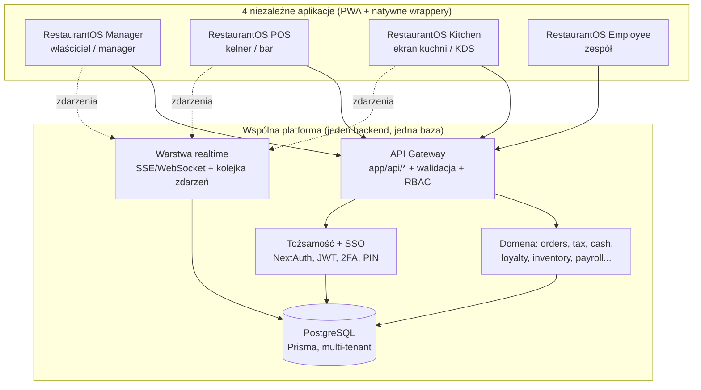

# RestaurantOS — Przeprojektowanie produktu (architektura + UX)

> Status: **PROPOZYCJA DO AKCEPTACJI**. Zgodnie z decyzją: najpierw architektura i doświadczenie
> użytkownika, dopiero po akceptacji wracamy do implementacji funkcji.
> Cel nie jest „najwięcej funkcji", tylko **najlepszy system gastronomiczny na świecie** —
> klasy Apple: prosty na wierzchu, bardzo rozbudowany pod spodem.

---

## 0. Punkt wyjścia (stan dzisiejszy)

Co już mamy i jest dobre:
- **Jeden backend, jedna baza.** Kompletna warstwa API (`app/api/*`), Prisma + PostgreSQL,
  multi-tenant (`organizationId` wszędzie), współdzielona logika domenowa (`lib/orderService`,
  `tax`, `cash`, `loyalty`, `settings`, `permissions`, `audit`).
- **RBAC oparty na uprawnieniach**, nie na nazwie roli (`OWNER` / `EMPLOYEE` + pakiety uprawnień:
  `SHIFT_MANAGER`, `ACCOUNTANT`, `STOCK_KEEPER`, `WAITER`).
- **Bramka auth** w jednym miejscu (`middleware.ts`), sesja JWT, 2FA (TOTP).
- PWA, i18n, audyt, ustawienia konfigurowalne z panelu.

Główny problem (to, co naprawiamy):
- **Jeden interfejs dla wszystkich.** `app/owner/layout.tsx` i wszystkie ekrany pracownika używają
  tego samego `AppShell` (Sidebar + TopBar). Różnica między właścicielem a kelnerem to tylko inne
  menu boczne. **Kelner pracuje w UI panelu administracyjnego** — to jest przeciwieństwo szybkiego POS-u.
- Brak rozdzielenia produktów: POS (sprzedaż przy stoliku) żyje wewnątrz „strefy pracownika"
  obok grafiku, urlopów i checklist. KDS to kolejna zakładka, a nie dedykowany ekran kuchni.

**Wniosek:** nie przepisujemy backendu. Rozdzielamy **warstwę produktową (frontend/UX)** na 4 osobne
aplikacje na wspólnym backendzie i jednej bazie, każda z własnym językiem projektowym i workflow.

---

## 1. Architektura docelowa — 4 aplikacje, jeden mózg



### Zasada nadrzędna
**Współdzielone są dane i reguły, NIE interfejs.** Każda aplikacja ma własny shell, własny język
projektowy, własną nawigację i własny rytm pracy. Wszystkie czytają i zapisują przez tę samą warstwę
domenową, więc zamówienie złożone w POS natychmiast pojawia się w Kitchen i w raportach Managera —
bez duplikacji logiki.

### Podział odpowiedzialności (cienki klient, gruba domena)
- **Domena (`packages/core`)** — cała logika biznesowa (ceny, VAT, rabaty, storno, lojalność,
  rozliczenia kasy, food cost). Jedno źródło prawdy, testowane jednostkowo. Aplikacje jej nie duplikują.
- **API (`app/api` → docelowo `apps/api`)** — walidacja (Zod), RBAC, multi-tenant, audyt, rate-limit.
- **Realtime** — nowa, kluczowa warstwa: strumień zdarzeń (`order.created`, `item.fired`,
  `item.ready`, `table.updated`, `86.changed`). Dziś brakuje; bez niej KDS i plan sali nie są „żywe".
- **Aplikacje klienckie** — wyłącznie prezentacja + interakcja + offline cache. Zero reguł cenowych.

---

## 2. Strategia pakowania i wdrożenia (DECYZJA DO PODJĘCIA)

Trzy realne warianty. Rekomendacja: **Wariant A (monorepo)** jako stan docelowy, osiągany etapami.

### Wariant A — Monorepo (Turborepo), 4 aplikacje + wspólne pakiety **[REKOMENDOWANY]**
```
restaurantos/
├─ apps/
│  ├─ api/        # backend: app/api/* (lub dedykowany serwis), Prisma, NextAuth
│  ├─ manager/    # Next.js, subdomena manager.restaurantos.pl
│  ├─ pos/        # Next.js, pos.restaurantos.pl  (PWA na tablet/telefon)
│  ├─ kitchen/    # Next.js, kds.restaurantos.pl  (ekran TV/tablet, kiosk)
│  └─ employee/   # Next.js, team.restaurantos.pl (PWA mobilna)
├─ packages/
│  ├─ core/       # logika domenowa (dzisiejsze lib/orderService, tax, cash, loyalty…)
│  ├─ db/         # schema Prisma + klient
│  ├─ auth/       # konfiguracja NextAuth + SSO między subdomenami
│  ├─ ui/         # prymitywy wspólne (tokeny, ikony, podstawowe komponenty)
│  └─ realtime/   # klient + serwer warstwy zdarzeń
```
- **SSO między aplikacjami:** ciasteczko sesji na domenie nadrzędnej `.restaurantos.pl` → jedno
  logowanie działa we wszystkich aplikacjach. App-switcher przełącza moduły bez ponownego logowania.
- **Plusy:** prawdziwa niezależność, najmniejszy bundle na aplikację (POS nie ładuje kodu Managera),
  niezależne wdrożenia, każdą aplikację instalujemy jako osobną PWA/kiosk na właściwym urządzeniu.
  To jest dokładnie „niezależne aplikacje korzystające z jednego backendu i jednej bazy".
- **Minusy:** więcej narzędzi (monorepo), konfiguracja subdomen + SSO, większy jednorazowy koszt migracji.

### Wariant B — Jedna aplikacja Next.js, 4 „shelle" przez route-groups
```
app/(manager)/…  app/(pos)/…  app/(kitchen)/…  app/(employee)/…
```
- Każda grupa ma własny `layout.tsx` (inny shell, inny design), routing po subdomenie w middleware.
- **Plusy:** najmniejszy koszt migracji, sesja i API „po prostu działają", jeden deploy.
- **Minusy:** jeden deployable (nie „osobne aplikacje" w sensie wdrożenia), współdzielony bundle
  (Next dzieli kod per-route, więc runtime POS nie ładuje stron Managera, ale granica jest miększa).

### Wariant C — Hybryda etapowa (droga do A) **[REKOMENDOWANA ŚCIEŻKA]**
1. **Etap 0** — wydziel `packages/core`, `packages/db`, `packages/auth`, `packages/ui` z dzisiejszego
   kodu (czysty refactor, bez zmian zachowania; testy zielone na każdym kroku).
2. **Etap 1** — wprowadź route-groups (Wariant B) i zbuduj nowe UX per moduł — szybki efekt, niskie ryzyko.
3. **Etap 2** — wydziel aplikacje do `apps/*` (Wariant A) z SSO na subdomenach, gdy UX jest dopięty.

> Dostajemy szybkie, widoczne efekty (nowy POS) bez ryzykownego „big bang", a kończymy w czystym
> stanie docelowym (4 niezależne aplikacje).

---

## 3. Model tożsamości, urządzeń i logowania

Najlepsze POS-y rozróżniają **urządzenie** od **osoby**. Dziś mamy tylko logowanie osobiste — za wolne
na współdzielony terminal w sali.

- **Manager / Employee** — logowanie osobiste (e-mail + hasło + opcjonalne 2FA). Sesja długa.
- **POS / Kitchen** — model **urządzenia współdzielonego**:
  - Urządzenie jest jednorazowo **sparowane** z lokalem (token urządzenia, nie konto osobowe).
  - Personel loguje się **szybkim PIN-em** (4–6 cyfr) → przełączanie użytkownika w <1 s, bez wylogowania
    urządzenia. Każda akcja (zamówienie, storno, rabat) przypisana do konkretnej osoby i audytowana.
  - Auto-wylogowanie operatora po bezczynności; urządzenie pozostaje zalogowane do lokalu.
- **Routing po zalogowaniu** zależny od uprawnień: użytkownik trafia do swojej domyślnej aplikacji
  (kelner → POS, kucharz → Kitchen, manager → Manager), a app-switcher pokazuje tylko te moduły,
  do których ma dostęp. Jedna osoba może mieć kilka (np. shift-manager: Manager + POS).
- **Rozszerzenie ról:** dzisiejsze `OWNER`/`EMPLOYEE` + pakiety uprawnień zostają. Dodajemy czytelne,
  konfigurowalne **profile dostępu do aplikacji** (kto widzi który moduł) — wszystko z panelu, bez kodu.

---

## 4. Cztery aplikacje — projekt UX

### 4.1 RestaurantOS Manager — „centrum dowodzenia"
**Użytkownik:** właściciel, manager, księgowość, magazynier. **Urządzenie:** desktop/laptop, tablet.
**Język projektowy:** gęsty, analityczny, ciemny motyw premium (jak dziś), ale z lepszą informacją (IA).

- **Reorganizacja nawigacji** w wyraźne domeny zamiast jednej długiej listy:
  `Pulpit & AI` · `Operacje` · `Finanse` · `Magazyn & Food cost` · `Ludzie (HR)` · `Goście (CRM)` ·
  `Ustawienia`. Mniej pozycji na wierzchu, reszta przez progresywne ujawnianie.
- **Command palette (⌘K)** — skok do dowolnego ekranu/akcji/raportu; szybkość pro-użytkownika.
- **Pulpity zależne od roli** — księgowa widzi finanse, magazynier magazyn; bez „ściany 40 kafelków".
- **AI COO** jako warstwa nadrzędna: nie kolejna zakładka, lecz asystent obecny w kontekście
  (np. „dlaczego food cost wzrósł?" przy raporcie).
- Zachowujemy całą dzisiejszą moc (analityka, raporty, magazyn, płace, CRM), porządkujemy dostęp.

### 4.2 RestaurantOS POS — „najszybszy POS na rynku" (serce redesignu)
**Użytkownik:** kelner, bar. **Urządzenie:** tablet, telefon, terminal stacjonarny, handheld.
**Język projektowy:** pełnoekranowy, wysokie kontrasty do słabego światła, **wielkie cele dotykowe**,
zasięg kciuka, zero estetyki „panelu admina". Każdy ekran zaprojektowany pod jedną rękę i pośpiech.

**Reguły, które robią różnicę (mierzalne cele):**
- Otwarcie stolika: **≤ 2 dotknięcia**. Wysłanie zamówienia do kuchni: **≤ 3 dotknięcia** od menu.
- **Offline-first.** Zamówienia działają bez sieci (kolejka lokalna, sync po powrocie). To pięta
  achillesowa większości konkurentów — u nas fundament, nie dodatek.
- **Jedno płótno** Sala → Stolik → Zamówienie, bez przeładowań stron; aktualizacje optymistyczne.
- **Menu:** siatka z kategoriami, inteligentne wyszukiwanie, „ostatnie / najczęstsze", flagi
  alergenów i 86 (niedostępne) widoczne od razu; **modyfikatory jako bottom-sheet** (jeden gest).
- **Coursing & miejsca (seats):** przypisanie pozycji do gościa/dania, „fire/hold", wysyłka kursami.
- **Podział rachunku** po pozycji / miejscu / kwocie / równo; szybka płatność; napiwki; szybkie zwroty.
- **Stan stolików** kolorem i kształtem + liczniki czasu + „wymaga uwagi" wypychane na wierzch.
- **Tryby:** restauracja (stoliki) i bar (szybkie taby/„quick sale") w jednej aplikacji.
- **Pay-at-table / handheld** i wejście pod **QR zamów&zapłać** (gość) — wspólne dane z POS.

### 4.3 RestaurantOS Kitchen (KDS) — „tylko kuchnia"
**Użytkownik:** kuchnia, ekspedycja. **Urządzenie:** ekran TV/tablet w trybie kiosk, bump bar.
**Język projektowy:** maksymalna czytelność z 2–3 m, ogromna typografia, kolor = status, zero ozdobników.

- **Szyna biletów** z czasem oczekiwania i progami SLA (kolory: świeży / uwaga / spóźniony).
- **Routing po stacjach** (grill, zimna, bar) + **ekran ekspedycji** (expo) scalający dania jednego stolika.
- **Timing kursów** — wstrzymanie i „fire" kolejnego kursu sterowane z POS, widoczne w kuchni.
- **All-day counts** (np. „12× burger w toku"), obciążenie stacji, **recall** zbitego biletu.
- **Przepis i alergeny na bilecie** (z modułu receptur) — mniej błędów, szybsze szkolenie.
- **Bump** dotykiem lub bump-barem; zdarzenie `item.ready` wraca do POS (kelner widzi „gotowe do wydania").

### 4.4 RestaurantOS Employee — „aplikacja zespołu"
**Użytkownik:** każdy pracownik. **Urządzenie:** telefon (PWA mobilna).
**Język projektowy:** lekki, „konsumencki" (jak dobra apka produktywności/social), a nie panel firmowy.

- **Home feed:** dzisiejsza zmiana, najbliższe zadania, ogłoszenia, powiadomienia — wszystko na wejściu.
- **Grafik:** mój grafik, dostępność, **giełda zmian** (oddaj/przejmij), urlopy z akceptacją.
- **Checklisty / SOP** z potwierdzeniem wykonania; **szkolenia** (ścieżki, postęp, certyfikaty).
- **Przepisy** (pełny przepis kulinarny — już mamy, z kontrolą dostępu) w wygodnej formie mobilnej.
- **Komunikacja:** wiadomości / ogłoszenia / push; e-podpis dokumentów.
- **Moje wyniki / napiwki** — transparentny podział puli napiwków.

---

## 5. Analiza konkurencji → ich ograniczenia → nasze lepsze rozwiązania

Nie kopiujemy. Dla każdego lidera wskazujemy słabość i naszą odpowiedź.

| System | Realne ograniczenie | Nasza lepsza odpowiedź |
|---|---|---|
| **Toast** | Zamknięty na własny hardware (Android), drogie dodatki „za wszystko", offline ograniczony, raporty przytłaczają | Sprzęt-agnostyczny PWA (dowolny tablet/telefon/TV), **prawdziwy offline-first**, przejrzysty modułowy cennik, pulpity kuratorowane |
| **Square** | Świetny dla małych, ale słaby dla pełnej obsługi (coursing, złożone modyfikatory, centra przychodu), płytki magazyn/food cost | Prostota Square + **głębia pełnej obsługi** ujawniana progresywnie, pełny food cost i wariancje |
| **Lightspeed** | Potężny, ale stroma krzywa uczenia, przestarzały UX, wolne wsparcie | **Progresywne ujawnianie** w stylu Apple, prowadzony onboarding, wbudowana pomoc AI w kontekście |
| **GoPOS** (PL) | Mocna fiskalizacja/lokalność, ale UX zachowawczy, słaba analityka/AI | Natywna fiskalizacja PL + **KSeF na mapie** + nowoczesne AI/analityka i lepszy UX |
| **Revel** | Tylko iPad, złożoność „enterprise", wysoki koszt | Dowolne urządzenie, ta sama moc bez przywiązania do platformy |
| **Oracle MICROS** | Ciężki, drogi, długie wdrożenie, dziedzictwo on-prem | **Cloud-native**, szybki self-onboarding, możliwości klasy enterprise bez ciężaru |

**Wspólne luki rynku = nasze wyróżniki:**
1. **Prawdziwy offline-first** w POS i KDS (większość degraduje się bez sieci).
2. **Jeden model danych pod 4 pięknymi aplikacjami** (konkurenci sklejają przejęte produkty).
3. **AI COO** wbudowane w kontekst, nie jako gadżet.
4. **Realtime wszędzie** (sala/KDS/POS żyją tą samą chwilą).
5. **Przejrzysty, modułowy cennik** i szybkie samodzielne wdrożenie.
6. **Klasa Apple:** proste na wierzchu, potężne pod spodem (progresywne ujawnianie).

---

## 6. Lista brakujących funkcji (zaprojektowanych „lepiej", nie skopiowanych)

Tylko projekt/priorytety — implementacja po akceptacji architektury.

**Platforma (fundament dla wszystkich):**
- Warstwa **realtime** (strumień zdarzeń) — bez niej POS/KDS nie są w pełni „żywe".
- **Offline-first SDK** (kolejka mutacji, idempotencja, rozwiązywanie konfliktów) współdzielone przez POS/KDS.
- **Model urządzeń + PIN** (parowanie urządzenia, szybkie przełączanie operatora).
- UI **granularnych ról i dostępu do aplikacji** (z panelu, bez kodu).
- **Webhooks / publiczne API** pod przyszłe integracje (płatności, delivery, księgowość).

**POS:** coursing & seats, podział rachunku (4 tryby), tryb baru/taby, pay-at-table/handheld,
QR zamów&zapłać, szybkie zwroty/korekty, abstrakcja płatności (terminal/bramka jako plugin).

**Kitchen:** routing stacji, ekran expo, timing kursów, all-day counts, recall, SLA, przepis na bilecie.

**Manager:** prognozowanie sprzedaży, optymalizacja grafiku do prognozy (labor vs sales),
**menu engineering** (macierz gwiazdy/zagadki/konie/psy), **food cost teoretyczny vs rzeczywisty** +
wariancje, zamówienia/PO + katalogi dostawców, konsolidacja wielu lokali, raporty cykliczne, wykrywanie anomalii.

**Employee:** giełda zmian, ścieżki szkoleń + certyfikaty, transparentny podział napiwków, e-podpis.

---

## 7. Plan migracji (bez przerywania działania)

| Etap | Zakres | Ryzyko | Efekt |
|---|---|---|---|
| 0 | Wydzielenie `packages/core,db,auth,ui` (refactor, testy zielone) | niskie | Czyste granice, zero zmian dla użytkownika |
| 1 | Warstwa realtime + offline SDK (fundament) | średnie | „Żywe" sala/KDS, praca bez sieci |
| 2 | **POS** jako osobna aplikacja/route-group + model PIN | średnie | Największy skok wartości |
| 3 | **Kitchen** (KDS) jako osobny ekran kiosk | niskie | Dedykowana kuchnia |
| 4 | **Employee** (apka mobilna zespołu) | niskie | Konsumencki UX dla zespołu |
| 5 | **Manager** — odświeżenie IA + command palette | niskie | Porządek i szybkość pro |
| 6 | Wydzielenie do `apps/*` + subdomeny + SSO (Wariant A) | średnie | Stan docelowy: 4 niezależne aplikacje |

Na każdym etapie: testy (unit/integration/smoke/E2E) zielone, brak regresji, stopniowe przełączanie.

---

## 8. Decyzje do akceptacji

1. **Strategia pakowania** — A (monorepo) / B (route-groups) / C (hybryda etapowa do A). Rekomendacja: **C → A**.
2. **Model POS** — współdzielony terminal + szybki PIN. Rekomendacja: **tak**.
3. **Kolejność budowy** — najpierw **POS** (największa wartość) czy najpierw fundament realtime/offline.
   Rekomendacja: fundament (Etap 1) → POS, bo POS bez offline/realtime nie będzie „najlepszy".
4. **Domeny/subdomeny** — `manager. / pos. / kds. / team. restaurantos.pl` (lub własna domena docelowa).

Po akceptacji (lub korekcie) tych punktów przechodzę do Etapu 0 i realizuję plan etapami.
