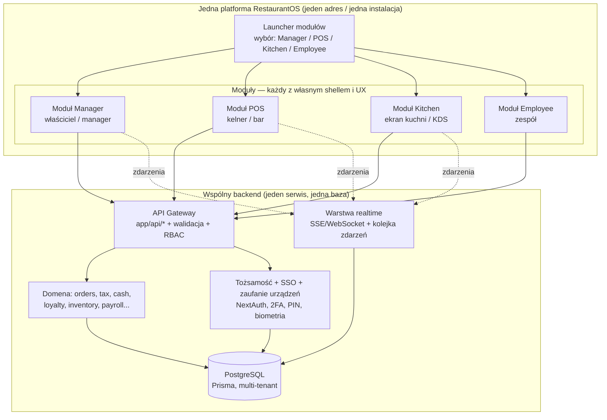

# RestaurantOS — Przeprojektowanie produktu (architektura + UX)

> Status: **ZAAKCEPTOWANE — w realizacji (plan A)**. Cel nie jest „najwięcej funkcji", tylko
> **najlepszy system gastronomiczny na świecie** — klasy Apple: prosty na wierzchu, rozbudowany pod spodem.

### Status realizacji
- ✅ **Etap 0/1 — fundament platformy:** launcher modułów (`/launcher`), routing korzenia
  (sesja → launcher; zaufane urządzenie z PIN → `/unlock`; inaczej → `/login`), **Tożsamość 2.0**:
  zaufanie urządzeń (`TrustedDevice`), szybkie odblokowanie **PIN-em** (NextAuth tryb `pin` czyta
  httpOnly cookie urządzenia), zarządzanie urządzeniami i PIN-em na `/security`, abstrakcja metod
  (`AuthMethodType`: PIN/WEBAUTHN/NFC/RFID). Testy: jednostkowe + integracyjny na żywo + E2E zielone.
- ⏭️ **Następne:** biometria **WebAuthn/passkey** (Face ID/Touch ID) jako kolejna metoda; potem
  warstwa **realtime + offline** (Etap 2), a następnie moduł **POS** (Etap 3).

---

## 0. Punkt wyjścia (stan dzisiejszy)

Co już mamy i jest dobre:
- **Jeden backend, jedna baza.** Kompletna warstwa API (`app/api/*`), Prisma + PostgreSQL,
  multi-tenant (`organizationId` wszędzie), współdzielona logika domenowa (`lib/orderService`,
  `tax`, `cash`, `loyalty`, `settings`, `permissions`, `audit`).
- **RBAC oparty na uprawnieniach**, nie na nazwie roli (`OWNER` / `EMPLOYEE` + pakiety uprawnień:
  `SHIFT_MANAGER`, `ACCOUNTANT`, `STOCK_KEEPER`, `WAITER`).
- **Bramka auth** w jednym miejscu (`middleware.ts`), sesja JWT, 2FA (TOTP).
- PWA, i18n, audyt, ustawienia konfigurowalne z panelu.

Główny problem (to, co naprawiamy):
- **Jeden interfejs dla wszystkich.** `app/owner/layout.tsx` i wszystkie ekrany pracownika używają
  tego samego `AppShell` (Sidebar + TopBar). Różnica między właścicielem a kelnerem to tylko inne
  menu boczne. **Kelner pracuje w UI panelu administracyjnego** — to jest przeciwieństwo szybkiego POS-u.
- Brak rozdzielenia produktów: POS (sprzedaż przy stoliku) żyje wewnątrz „strefy pracownika"
  obok grafiku, urlopów i checklist. KDS to kolejna zakładka, a nie dedykowany ekran kuchni.

**Wniosek:** nie przepisujemy backendu. To **jedna platforma RestaurantOS** z czterema **modułami**,
z których każdy ma całkowicie inny interfejs i UX, ale wszystkie działają na wspólnym backendzie i jednej
bazie. Dla użytkownika to jeden produkt, nie cztery — z ekranem wyboru modułu na wejściu.

---

## 1. Architektura docelowa — JEDNA platforma, cztery moduły

> **Zasada produktowa (zmiana koncepcji):** to **nie** są cztery osobne aplikacje/produkty.
> To jedna platforma. Po wejściu użytkownik widzi **launcher modułów** (Owner/Manager · POS · Kitchen ·
> Employee) i wybiera moduł, a potem loguje się do niego — albo, jeśli ma aktywną sesję, wchodzi od razu.
> Każdy moduł = inny interfejs i rytm pracy, ale wspólne dane, reguły i jedno logowanie (SSO).



### Zasada nadrzędna
**Współdzielone są dane, reguły i tożsamość; różny jest TYLKO interfejs.** Każdy moduł ma własny shell,
język projektowy, nawigację i rytm pracy. Wszystkie czytają/zapisują przez tę samą warstwę domenową,
więc zamówienie złożone w POS natychmiast pojawia się w Kitchen i w raportach Managera — bez duplikacji
logiki i bez „przesiadki" między produktami.

### Launcher modułów (ekran wejścia)
- Po otwarciu platformy: **kafelki modułów**, ale tylko te, do których użytkownik/urządzenie ma dostęp
  (kelner zwykle widzi POS; manager — wszystkie). Wybór modułu → wejście do jego shella.
- **Aktywna sesja → wejście bez pytania.** Brak/wygasła sesja → szybkie odblokowanie (PIN/biometria)
  lub pełne logowanie (patrz §3).
- **Zapamiętany ostatni moduł** + możliwość „przypięcia" urządzenia do modułu (np. tablet w sali zawsze
  startuje w POS, ekran w kuchni zawsze w Kitchen) — bez utraty jednolitości platformy.
- **Przełącznik modułów** dostępny wewnątrz każdego shella (dla osób z dostępem do wielu), bez
  ponownego logowania.

### Podział odpowiedzialności (cienki klient, gruba domena)
- **Domena (`packages/core`)** — cała logika biznesowa (ceny, VAT, rabaty, storno, lojalność,
  rozliczenia kasy, food cost). Jedno źródło prawdy, testowane jednostkowo. Moduły jej nie duplikują.
- **API (`app/api`)** — walidacja (Zod), RBAC, multi-tenant, audyt, rate-limit.
- **Realtime** — nowa, kluczowa warstwa: strumień zdarzeń (`order.created`, `item.fired`,
  `item.ready`, `table.updated`, `86.changed`). Dziś brakuje; bez niej KDS i plan sali nie są „żywe".
- **Moduły klienckie** — wyłącznie prezentacja + interakcja + offline cache. Zero reguł cenowych.

---

## 2. Strategia pakowania (dostosowana do „jednej platformy")

Skoro to **jedna platforma**, a nie cztery produkty, odrzucamy wariant z osobnymi aplikacjami na
subdomenach. Cel: jeden adres, jedna instalacja, jeden bundle bazowy, cztery shelle modułów.

### Rekomendacja: jedna aplikacja Next.js, moduły jako route-groups
```
app/
├─ launcher/             # ekran wyboru modułu (po wejściu / po odblokowaniu)
├─ (manager)/…           # shell + UX modułu Manager  (własny layout)
├─ (pos)/…               # shell + UX modułu POS       (własny layout, pełny ekran)
├─ (kitchen)/…           # shell + UX modułu Kitchen   (własny layout, kiosk)
├─ (employee)/…          # shell + UX modułu Employee  (własny layout, mobilny)
├─ (auth)/…              # logowanie, odblokowanie (PIN/biometria), zaufanie urządzenia
└─ api/…                 # wspólny backend (bez zmian)

lib/  (z czasem → packages/)
├─ core/    # logika domenowa: orders, tax, cash, loyalty, inventory, payroll…
├─ auth/    # tożsamość, SSO, zaufanie urządzeń, metody logowania (PIN/WebAuthn/NFC…)
├─ realtime/# klient + serwer warstwy zdarzeń
└─ ui/      # tokeny i prymitywy współdzielone (reszta UI jest per-moduł)
```
- **Jedno SSO „za darmo":** ta sama sesja działa we wszystkich modułach (jeden origin, jedno
  ciasteczko). Przełącznik modułów nie wymaga ponownego logowania.
- **Różny UX, wspólny rdzeń:** każdy route-group ma własny `layout.tsx` (inny shell, inna nawigacja,
  inny język wizualny). Next dzieli kod per-route, więc runtime POS nie ładuje ekranów Managera.
- **Instalacja PWA per urządzenie:** jedną platformę można zainstalować jako PWA i „przypiąć" do
  modułu (start od `/launcher` lub bezpośrednio w `(pos)`/`(kitchen)`), zachowując jeden produkt.
- **Wewnętrzna higiena kodu:** logikę współdzieloną stopniowo przenosimy z `lib/*` do `packages/*`
  (czysty refactor), ale **to nie zmienia faktu, że dla użytkownika jest jedna platforma**.

### Ścieżka realizacji (etapowa, bez „big bang")
1. **Etap 0** — uporządkuj granice: wydziel `lib/core`, `lib/auth`, `lib/ui` (refactor, testy zielone).
2. **Etap 1** — dodaj **launcher** + route-groups modułów + nowy model logowania (§3).
3. **Etap 2** — buduj UX modułów po kolei (POS najpierw lub fundament — patrz §8), na wspólnym backendzie.

---

## 3. Tożsamość, zaufanie urządzeń i logowanie (projekt docelowy)

Cel: **maksymalna wygoda i maksymalne bezpieczeństwo naraz** — tak jak zrobiłby to najlepszy nowoczesny
POS. Rozdzielamy trzy niezależne pojęcia i składamy z nich elastyczny model:

| Warstwa | Pytanie | Mechanizm |
|---|---|---|
| **Tożsamość** | *Kim jesteś?* | konto: e-mail + hasło (+ 2FA dla właściciela, jeśli włączone) |
| **Zaufanie urządzenia** | *Czy temu sprzętowi ufamy?* | rekord urządzenia + token związany z urządzeniem (po pełnym logowaniu i wyrażeniu zaufania) |
| **Szybkie odblokowanie** | *Jak wrócić błyskawicznie?* | PIN **lub** biometria (Face ID/Touch ID przez WebAuthn/passkey) na zaufanym urządzeniu |

### 3.1 Trzy przepływy

**A. Pierwsze uruchomienie na NOWYM urządzeniu — zawsze pełne logowanie**
1. E-mail + hasło (+ TOTP, jeśli rola ma wymuszone 2FA — dziś dotyczy właściciela, konfigurowalne).
2. Pytanie **„Zaufać temu urządzeniu?"** → tworzymy rekord `Device` (po stronie serwera) i wydajemy
   **token urządzenia** zapisany w bezpiecznym magazynie przeglądarki/PWA. Urządzenie niezaufane =
   sesja jednorazowa, bez zapamiętywania.
3. Propozycja włączenia szybkiego odblokowania: **ustaw PIN** i/lub **włącz biometrię** (passkey).
   Od tej chwili hasło nie jest potrzebne przy kolejnych wejściach na tym urządzeniu.

**B. Kolejne uruchomienia na ZAUFANYM urządzeniu — szybkie odblokowanie (bez hasła)**
1. Aplikacja wykrywa token urządzenia → zamiast hasła pokazuje **ekran odblokowania**: biometria
   (jeśli włączona) lub PIN.
2. Sukces → sesja modułu. **Aktywna, ważna sesja → wejście od razu**, bez żadnego ekranu (zgodnie z
   życzeniem: launcher → moduł bez tarcia).
3. Token urządzenia wygasł/odwołany albo zbyt wiele błędnych prób → **fallback do pełnego logowania (A)**.

**C. Moduł POS — błyskawiczny PIN na współdzielonym terminalu**
- Terminal w sali jest **zaufanym urządzeniem przypisanym do lokalu**. Ekran POS to **klawiatura PIN**:
  kelner wpisuje 4–6 cyfr → operator zalogowany w <1 s, bez wylogowania urządzenia.
- **Szybkie przełączanie operatora** (kolejny kelner = nowy PIN), auto-wylogowanie operatora po
  bezczynności; urządzenie pozostaje zaufane. Każda akcja (zamówienie, storno, rabat, płatność)
  przypisana do konkretnej osoby i **audytowana** (mamy już `AuditLog`).
- Na urządzeniu osobistym (telefon kelnera) zamiast PIN-u można użyć biometrii.

### 3.2 Dlaczego to jest bezpieczne (a nie tylko wygodne)
- **Wieloskładnikowość zachowana, ale „raz, mądrze".** Zaufane urządzenie (posiadanie) + PIN (wiedza)
  lub biometria (cecha) to realne MFA. Dlatego po zaufaniu urządzeniu **nie prosimy o TOTP przy każdym
  wejściu** — to byłaby uciążliwość bez zysku. TOTP/hasło wraca, gdy urządzenie nie jest zaufane,
  token wygasł, lub przy operacjach wrażliwych (poniżej).
- **Biometria klasy bankowej:** **WebAuthn / passkey** — klucz prywatny nie opuszcza bezpiecznego
  enklawy urządzenia (Secure Enclave/TPM), serwer zna tylko klucz publiczny. To dziś najlepszy standard
  Face ID/Touch ID w aplikacjach web/PWA i naturalnie rozszerzalny.
- **PIN bezpieczny:** hashowany (bcrypt), **rate-limit + blokada** po N błędach → wymuszenie pełnego
  logowania; PIN nigdy nie zastępuje hasła na nowym urządzeniu.
- **Zarządzanie zaufaniem:** Manager widzi **listę zaufanych urządzeń** (nazwa, lokal, ostatnia
  aktywność) i może je **odwołać** zdalnie („wyloguj wszędzie"). Utrata tabletu = jeden klik.
- **Step-up auth (podniesienie poziomu):** operacje wrażliwe (duże storno, zmiana ustawień finansowych,
  eksport danych) mogą wymagać **ponownego potwierdzenia** (PIN/biometria/hasło) niezależnie od sesji.
- **Wygasanie warstwowe:** krótka sesja operacyjna (np. zmiana robocza) + długie, odwoływalne zaufanie
  urządzenia. Best of both worlds.

### 3.3 Rozszerzalność — abstrakcja metod logowania
Projektujemy **pluggable `AuthMethod`** (jak nasza abstrakcja dostawców kampanii). Każda metoda
implementuje `enroll()` + `verify()`, a ekran odblokowania renderuje metody dostępne dla danego
urządzenia/użytkownika:

```
AuthMethod (interfejs)
├─ password     (jest)
├─ totp         (jest — 2FA)
├─ pin          (nowe — szybkie odblokowanie / POS)
├─ webauthn     (nowe — Face ID / Touch ID / passkey)
└─ [przyszłość] nfc · rfid · badge-qr · magstripe   ← dodanie = nowy provider, bez zmian rdzenia
```
- Dodanie **NFC/RFID** później = nowy provider + obsługa czytnika na zaufanym urządzeniu (np. tablet POS
  z czytnikiem zbliżeniowym → logowanie kartą personelu). Reszta systemu bez zmian.
- **Możliwości urządzenia** decydują, które metody są oferowane (terminal z NFC pokaże „przyłóż kartę").

### 3.4 Wpływ na model danych (szkic — do akceptacji)
- **`Device`** — `id`, `organizationId`, `locationId?`, `name`, `trustedAt`, `lastSeenAt`, `revokedAt?`,
  `boundUserId?` (urządzenie osobiste) lub tryb współdzielony (POS terminal lokalu).
- **`UserAuthCredential`** — `userId`, `type` (`pin`/`webauthn`/…), `secret/publicKey`, `deviceId?`,
  `createdAt`, `lastUsedAt`, liczniki prób. (PIN/WebAuthn per użytkownik, opcjonalnie per urządzenie.)
- Dzisiejsze pola 2FA na `User` zostają; PIN/WebAuthn dokładamy obok jako metody.

### 3.5 Dostęp do modułów (kto co widzi w launcherze)
- Dzisiejsze `OWNER`/`EMPLOYEE` + pakiety uprawnień zostają. Dodajemy konfigurowalne **profile dostępu
  do modułów** (kto widzi Manager/POS/Kitchen/Employee) — z panelu, bez kodu.
- Launcher pokazuje tylko dozwolone moduły; przełącznik modułów wewnątrz shella — dla osób z dostępem
  do wielu (np. shift-manager: Manager + POS), bez ponownego logowania.

---

## 4. Cztery moduły — projekt UX

> Każdy moduł to osobny shell/UX wewnątrz jednej platformy (route-group), nie osobny produkt.

### 4.1 Moduł Manager — „centrum dowodzenia"
**Użytkownik:** właściciel, manager, księgowość, magazynier. **Urządzenie:** desktop/laptop, tablet.
**Język projektowy:** gęsty, analityczny, ciemny motyw premium (jak dziś), ale z lepszą informacją (IA).

- **Reorganizacja nawigacji** w wyraźne domeny zamiast jednej długiej listy:
  `Pulpit & AI` · `Operacje` · `Finanse` · `Magazyn & Food cost` · `Ludzie (HR)` · `Goście (CRM)` ·
  `Ustawienia`. Mniej pozycji na wierzchu, reszta przez progresywne ujawnianie.
- **Command palette (⌘K)** — skok do dowolnego ekranu/akcji/raportu; szybkość pro-użytkownika.
- **Pulpity zależne od roli** — księgowa widzi finanse, magazynier magazyn; bez „ściany 40 kafelków".
- **AI COO** jako warstwa nadrzędna: nie kolejna zakładka, lecz asystent obecny w kontekście
  (np. „dlaczego food cost wzrósł?" przy raporcie).
- Zachowujemy całą dzisiejszą moc (analityka, raporty, magazyn, płace, CRM), porządkujemy dostęp.

### 4.2 Moduł POS — „najszybszy POS na rynku" (serce redesignu)
**Użytkownik:** kelner, bar. **Urządzenie:** tablet, telefon, terminal stacjonarny, handheld.
**Język projektowy:** pełnoekranowy, wysokie kontrasty do słabego światła, **wielkie cele dotykowe**,
zasięg kciuka, zero estetyki „panelu admina". Każdy ekran zaprojektowany pod jedną rękę i pośpiech.

**Reguły, które robią różnicę (mierzalne cele):**
- Otwarcie stolika: **≤ 2 dotknięcia**. Wysłanie zamówienia do kuchni: **≤ 3 dotknięcia** od menu.
- **Offline-first.** Zamówienia działają bez sieci (kolejka lokalna, sync po powrocie). To pięta
  achillesowa większości konkurentów — u nas fundament, nie dodatek.
- **Jedno płótno** Sala → Stolik → Zamówienie, bez przeładowań stron; aktualizacje optymistyczne.
- **Menu:** siatka z kategoriami, inteligentne wyszukiwanie, „ostatnie / najczęstsze", flagi
  alergenów i 86 (niedostępne) widoczne od razu; **modyfikatory jako bottom-sheet** (jeden gest).
- **Coursing & miejsca (seats):** przypisanie pozycji do gościa/dania, „fire/hold", wysyłka kursami.
- **Podział rachunku** po pozycji / miejscu / kwocie / równo; szybka płatność; napiwki; szybkie zwroty.
- **Stan stolików** kolorem i kształtem + liczniki czasu + „wymaga uwagi" wypychane na wierzch.
- **Tryby:** restauracja (stoliki) i bar (szybkie taby/„quick sale") w jednym module.
- **Pay-at-table / handheld** i wejście pod **QR zamów&zapłać** (gość) — wspólne dane z POS.

### 4.3 Moduł Kitchen (KDS) — „tylko kuchnia"
**Użytkownik:** kuchnia, ekspedycja. **Urządzenie:** ekran TV/tablet w trybie kiosk, bump bar.
**Język projektowy:** maksymalna czytelność z 2–3 m, ogromna typografia, kolor = status, zero ozdobników.

- **Szyna biletów** z czasem oczekiwania i progami SLA (kolory: świeży / uwaga / spóźniony).
- **Routing po stacjach** (grill, zimna, bar) + **ekran ekspedycji** (expo) scalający dania jednego stolika.
- **Timing kursów** — wstrzymanie i „fire" kolejnego kursu sterowane z POS, widoczne w kuchni.
- **All-day counts** (np. „12× burger w toku"), obciążenie stacji, **recall** zbitego biletu.
- **Przepis i alergeny na bilecie** (z modułu receptur) — mniej błędów, szybsze szkolenie.
- **Bump** dotykiem lub bump-barem; zdarzenie `item.ready` wraca do POS (kelner widzi „gotowe do wydania").

### 4.4 Moduł Employee — „przestrzeń zespołu"
**Użytkownik:** każdy pracownik. **Urządzenie:** telefon (PWA mobilna).
**Język projektowy:** lekki, „konsumencki" (jak dobra apka produktywności/social), a nie panel firmowy.

- **Home feed:** dzisiejsza zmiana, najbliższe zadania, ogłoszenia, powiadomienia — wszystko na wejściu.
- **Grafik:** mój grafik, dostępność, **giełda zmian** (oddaj/przejmij), urlopy z akceptacją.
- **Checklisty / SOP** z potwierdzeniem wykonania; **szkolenia** (ścieżki, postęp, certyfikaty).
- **Przepisy** (pełny przepis kulinarny — już mamy, z kontrolą dostępu) w wygodnej formie mobilnej.
- **Komunikacja:** wiadomości / ogłoszenia / push; e-podpis dokumentów.
- **Moje wyniki / napiwki** — transparentny podział puli napiwków.

---

## 5. Analiza konkurencji → ich ograniczenia → nasze lepsze rozwiązania

Nie kopiujemy. Dla każdego lidera wskazujemy słabość i naszą odpowiedź.

| System | Realne ograniczenie | Nasza lepsza odpowiedź |
|---|---|---|
| **Toast** | Zamknięty na własny hardware (Android), drogie dodatki „za wszystko", offline ograniczony, raporty przytłaczają | Sprzęt-agnostyczny PWA (dowolny tablet/telefon/TV), **prawdziwy offline-first**, przejrzysty modułowy cennik, pulpity kuratorowane |
| **Square** | Świetny dla małych, ale słaby dla pełnej obsługi (coursing, złożone modyfikatory, centra przychodu), płytki magazyn/food cost | Prostota Square + **głębia pełnej obsługi** ujawniana progresywnie, pełny food cost i wariancje |
| **Lightspeed** | Potężny, ale stroma krzywa uczenia, przestarzały UX, wolne wsparcie | **Progresywne ujawnianie** w stylu Apple, prowadzony onboarding, wbudowana pomoc AI w kontekście |
| **GoPOS** (PL) | Mocna fiskalizacja/lokalność, ale UX zachowawczy, słaba analityka/AI | Natywna fiskalizacja PL + **KSeF na mapie** + nowoczesne AI/analityka i lepszy UX |
| **Revel** | Tylko iPad, złożoność „enterprise", wysoki koszt | Dowolne urządzenie, ta sama moc bez przywiązania do platformy |
| **Oracle MICROS** | Ciężki, drogi, długie wdrożenie, dziedzictwo on-prem | **Cloud-native**, szybki self-onboarding, możliwości klasy enterprise bez ciężaru |

**Wspólne luki rynku = nasze wyróżniki:**
1. **Prawdziwy offline-first** w POS i KDS (większość degraduje się bez sieci).
2. **Jeden model danych pod 4 pięknymi modułami jednej platformy** (konkurenci sklejają przejęte produkty).
3. **AI COO** wbudowane w kontekst, nie jako gadżet.
4. **Realtime wszędzie** (sala/KDS/POS żyją tą samą chwilą).
5. **Przejrzysty, modułowy cennik** i szybkie samodzielne wdrożenie.
6. **Klasa Apple:** proste na wierzchu, potężne pod spodem (progresywne ujawnianie).

---

## 6. Lista brakujących funkcji (zaprojektowanych „lepiej", nie skopiowanych)

Tylko projekt/priorytety — implementacja po akceptacji architektury.

**Platforma (fundament dla wszystkich):**
- **Launcher modułów** + przełącznik modułów + „przypięcie" urządzenia do modułu.
- **Tożsamość 2.0:** zaufanie urządzeń (`Device`), szybkie odblokowanie PIN + biometria (WebAuthn),
  abstrakcja `AuthMethod` (pod NFC/RFID), zarządzanie/odwoływanie urządzeń, step-up auth (§3).
- Warstwa **realtime** (strumień zdarzeń) — bez niej POS/KDS nie są w pełni „żywe".
- **Offline-first SDK** (kolejka mutacji, idempotencja, rozwiązywanie konfliktów) współdzielone przez POS/KDS.
- UI **granularnych ról i dostępu do modułów** (z panelu, bez kodu).
- **Webhooks / publiczne API** pod przyszłe integracje (płatności, delivery, księgowość).

**POS:** coursing & seats, podział rachunku (4 tryby), tryb baru/taby, pay-at-table/handheld,
QR zamów&zapłać, szybkie zwroty/korekty, abstrakcja płatności (terminal/bramka jako plugin).

**Kitchen:** routing stacji, ekran expo, timing kursów, all-day counts, recall, SLA, przepis na bilecie.

**Manager:** prognozowanie sprzedaży, optymalizacja grafiku do prognozy (labor vs sales),
**menu engineering** (macierz gwiazdy/zagadki/konie/psy), **food cost teoretyczny vs rzeczywisty** +
wariancje, zamówienia/PO + katalogi dostawców, konsolidacja wielu lokali, raporty cykliczne, wykrywanie anomalii.

**Employee:** giełda zmian, ścieżki szkoleń + certyfikaty, transparentny podział napiwków, e-podpis.

---

## 7. Plan migracji (bez przerywania działania)

| Etap | Zakres | Ryzyko | Efekt |
|---|---|---|---|
| 0 | Uporządkowanie granic kodu (`lib/core,auth,ui`), testy zielone | niskie | Czyste granice, zero zmian dla użytkownika |
| 1 | **Launcher modułów** + route-groups + **Tożsamość 2.0** (zaufane urządzenie, PIN, biometria) | średnie | Jedna platforma z wyborem modułu i nowoczesnym logowaniem |
| 2 | Warstwa **realtime + offline SDK** (fundament POS/KDS) | średnie | „Żywe" sala/KDS, praca bez sieci |
| 3 | **Moduł POS** (nowy UX, PIN, coursing, podział rachunku) | średnie | Największy skok wartości |
| 4 | **Moduł Kitchen** (KDS, kiosk) | niskie | Dedykowana kuchnia |
| 5 | **Moduł Employee** (mobilny, konsumencki UX) | niskie | Przestrzeń zespołu |
| 6 | **Moduł Manager** — odświeżenie IA + command palette | niskie | Porządek i szybkość pro |

Na każdym etapie: testy (unit/integration/smoke/E2E) zielone, brak regresji, stopniowe przełączanie.

---

## 8. Co jest USTALONE, a co zostaje do potwierdzenia

**Ustalone (Twoja decyzja):**
- ✅ **Jedna platforma** RestaurantOS z **launcherem modułów** (Manager/POS/Kitchen/Employee), nie cztery
  osobne produkty. Pakowanie: jedna aplikacja + moduły jako route-groups, wspólny backend (§2).
- ✅ **Logowanie:** pierwsze wejście na nowym urządzeniu = e-mail+hasło (+2FA właściciela); po zaufaniu
  urządzeniu **szybkie odblokowanie PIN/biometria**; w POS **błyskawiczny PIN**; abstrakcja metod pod
  przyszłe NFC/RFID; bezpieczeństwo: rate-limit, odwoływanie urządzeń, step-up auth (§3).

**Do potwierdzenia (jedno pytanie):**
1. **Kolejność budowy po Etapie 0+1.** Rekomendacja: najpierw **fundament realtime+offline (Etap 2)**,
   potem **POS (Etap 3)** — bo POS bez offline/realtime nie będzie „najlepszy na świecie".
   Alternatywa: najpierw POS (szybszy widoczny efekt), offline/realtime zaraz po.
2. *(opcjonalnie)* Nazewnictwo dostępu po domenie docelowej — nieblokujące, mogę przyjąć domyślne.

Po Twoim „akceptuję" (lub korekcie) przechodzę do **Etapu 0** i realizuję plan etapami, z zielonymi
testami i bez regresji na każdym kroku.
